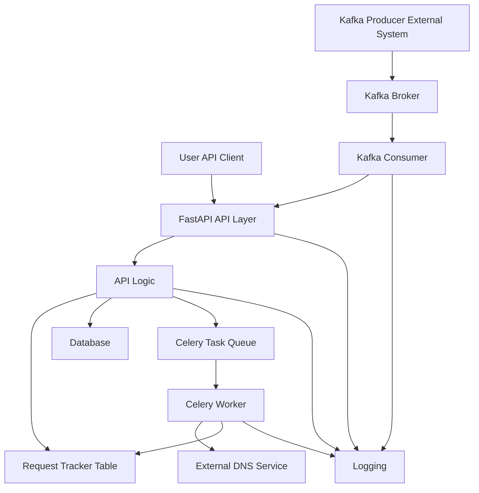

#
---

## 1. High-Level Architecture Flow

The application is designed as a microservice that orchestrates DNS record creation, leveraging FastAPI for the API, Celery for asynchronous tasks, Kafka for messaging, and PostgreSQL for data persistence.



**Explanation of Flow:**
1.  **User/API Client** or **External Kafka Producer** can initiate a DNS request:
    - User/API Client sends a REST request to the FastAPI API layer.
    - External system sends a message to Kafka Broker.

2.  **Kafka Consumer** (`scripts/run_consumer.py`) consumes messages from Kafka and calls the FastAPI API (as if it were a client).
3.  **API Layer** (FastAPI) receives requests (from user or Kafka consumer), immediately creates a new entry in the **Request Tracker Table** and starts logging.
4.  **API Logic** performs validation and business operations, updating the **Request Tracker Table** and logs at every step, interacts with the main database, and enqueues async tasks to Celery.
5.  **Celery Task Queue** receives async jobs, processed by **Celery Worker**.
6.  **Celery Worker** performs the actual DNS provisioning (e.g., via external DNS service), and updates the **Request Tracker Table** and logs with results.
7.  **Observability:** Logging and request tracking start as soon as the request is received and are updated at every step for full traceability.

**Key Points:**
- Both Kafka and API are entry points for requests.
- Kafka consumer always calls the API for business logic, ensuring a single flow.
- Request tracking and logging start as soon as the API receives a request and are updated at every step (API, Celery, etc.).

## 2. Directory Structure and Purpose

```
.
├── app/                  # Main application source code
│   ├── api/              # API Logic (Business Logic for Endpoints)
│   │   ├── common/       # Common API utilities shared across versions
│   │   ├── v1/           # Version 1 API logic
│   │   │   └── api.py    # Logic for v1 endpoints
│   │   └── v2/           # Version 2 API logic
│   │       └── api.py    # Logic for v2 endpoints
│   ├── celery/           # Celery-related files
│   │   └── tasks.py      # Celery task definitions
│   ├── core/             # Core application components
│   │   ├── celery_app.py # Celery application instance
│   │   ├── config.py     # Application settings and configuration
│   │   ├── database.py   # Database connection and session management
│   │   ├── logging.py    # Logging configuration
│   │   └── secrets.py    # Centralized Secrets Management (CSM) integration
│   ├── kafka/            # Kafka-related components
│   │   └── consumer.py   # Kafka consumer logic
│   ├── models/           # SQLAlchemy database models
│   │   ├── migrations/   # Alembic migration scripts
│   │   └── models.py     # Database models
│   ├── routes/           # API Routing Definitions
│   │   ├── v1/           # Version 1 API routes
│   │   │   └── routes.py # Route definitions for v1
│   │   └── v2/           # Version 2 API routes
│   │       └── routes.py # Route definitions for v2
│   ├── schemas/          # Pydantic models for request/response validation
│   │   ├── request.py    # Request models
│   │   └── response.py   # Response models
│   └── utils/            # General-purpose utility functions/modules (e.g., helpers, common functions)
├── deployment/           # Deployment-related files (Docker, Kubernetes/OpenShift manifests)
│   ├── Dockerfile.app    # Dockerfile for the FastAPI application image
│   ├── Dockerfile.worker # Dockerfile for the Celery worker image
│   ├── docker-compose.yml # Docker Compose for local development setup
│   ├── entrypoint.sh     # Main application entrypoint script for Docker
│   └── celery_worker_entrypoint.sh # Celery worker entrypoint script for Docker
├── env/                  # Environment-specific configuration files (.env files)
│   ├── .env.dev          # Development environment variables
│   ├── .env.prod         # Production environment variables
│   └── .env.uta          # User Testing Acceptance environment variables
├── scripts/              # Standalone executable scripts (e.g., run_consumer.py)
├── tests/                # Unit and integration tests
├── alembic.ini           # Alembic configuration file (if initialized)
├── pyproject.toml        # Poetry project definition and dependencies
├── poetry.lock           # Poetry lock file (exact dependency versions)
├── POETRY_GUIDE.md       # Guide for Poetry setup and usage
└── README.md             # Project overview and main entry point
```

## 3. What to Write Where

*   **`app/api/vX/api.py`**:
    *   **Purpose:** Contains the actual business logic for your API endpoints. This is where you'll write the code that interacts with the database, calls external services, or dispatches tasks.
    *   **Content:** Functions that perform operations like creating, reading, updating, or deleting resources. These functions should be pure Python functions that take necessary arguments and return data. They should *not* contain FastAPI decorators (`@router.get`, `@router.post`, etc.).
    *   **Example:** A function `create_dns_record_logic(data: DnsRequestCreate, db: Session)`

*   **`app/routes/vX/routes.py`**:
    *   **Purpose:** Defines the API endpoints and maps them to the corresponding business logic functions. This is the "routing" layer.
    *   **Content:** FastAPI `APIRouter` instances, and functions decorated with `@router.get`, `@router.post`, etc. These functions should primarily call the logic functions from `app/api/vX/api.py` and handle request/response serialization.
    *   **Example:**
        ```python
        from fastapi import APIRouter, Depends
        from app.api.v1.api import create_dns_record_logic

        router = APIRouter()

        @router.post("/create")
        def create_dns_record(request: DnsRequestCreate, db: Session = Depends(get_db)):
            return create_dns_record_logic(request, db)
        ```

*   **`app/schemas/`**:
    *   **Purpose:** Defines the data structures for your application.
    *   **Content:**
        *   `request.py`: Pydantic models for incoming request bodies.
        *   `response.py`: Pydantic models for outgoing response bodies.

*   **`app/models/`**:
    *   **Purpose:** Houses SQLAlchemy database models and Alembic migration scripts.
    *   **Content:**
        *   `models.py`: SQLAlchemy ORM models that define your database tables.
        *   `migrations/`: Directory containing Alembic migration scripts.

*   **`app/core/`**:
    *   **Purpose:** Contains fundamental, cross-cutting concerns of your application.
    *   **Content:** Configuration loading, database connection setup, logging configuration, secrets management integration, Celery application instance.

*   **`app/celery/`**:
    *   **Purpose:** Houses Celery task definitions.
    *   **Content:**
        *   `tasks.py`: Definitions of your Celery tasks (functions decorated with `@celery_app.task`).

*   **`app/kafka/`**:
    *   **Purpose:** Contains Kafka-specific consumer and producer logic.
    *   **Content:** Functions or classes that interact with Kafka brokers to consume or produce messages.

*   **`app/utils/`**:
    *   **Purpose:** For general-purpose utility functions or modules that are reusable across different parts of the `app/` package and are not specific to API, database, or messaging.
    *   **Content:** Helper functions for data manipulation, common validators, custom exceptions, etc.

*   **`app/api/common/`**:
    *   **Purpose:** For utility functions or modules that are specific to the API layer but are shared across different API versions (e.g., `v1`, `v2`).
    *   **Content:** Common authentication helpers, response transformers, request pre-processors that apply to multiple API versions.

*   **`deployment/`**:
    *   **Purpose:** Contains all files related to deploying your application.
    *   **Content:** Dockerfiles, Docker Compose files, Kubernetes/OpenShift manifests (e.g., YAML files for Deployments, Services, Routes, ConfigMaps, Secrets), shell scripts for container entrypoints.

*   **`env/`**:
    *   **Purpose:** Stores environment-specific configuration variables.
    *   **Content:** `.env` files for development, production, testing, etc. (e.g., database URLs, API keys, external service endpoints). These files should NOT be committed to version control if they contain sensitive information.

*   **`scripts/`**:
    *   **Purpose:** For standalone executable Python scripts that perform specific tasks (e.g., data migration scripts, one-off administrative tasks, consumer runners).
    *   **Content:** `run_consumer.py` or similar.
## 4. Dynamic API Versioning

This project implements a dynamic API versioning strategy that allows for easy management and scaling of different API versions (e.g., `v1`, `v2`). This is achieved by leveraging FastAPI's `APIRouter` and Python's dynamic import capabilities.

**How it Works:**

1.  **Versioned Directories:** API logic and routing definitions are organized into version-specific directories:
    *   `app/api/v1/` and `app/routes/v1/` for Version 1.
    *   `app/api/v2/` and `app/routes/v2/` for Version 2.
    *   New versions (e.g., `v3`) can be added by simply creating `app/api/v3/` and `app/routes/v3/` directories.

2.  **Centralized Router Registration (`app/main.py`):**
    The `app/main.py` file dynamically discovers and registers routers for each API version. It iterates through the `app/routes/` directory, identifies version folders (e.g., `v1`, `v2`), and then looks for a `routes.py` file within each version.

    ```python
    # Snippet from app/main.py
    from pathlib import Path
    import importlib

    routes_path = Path(__file__).parent / "routes"
    for version_pkg in routes_path.iterdir():
        if version_pkg.is_dir() and not version_pkg.name.startswith("__"):
            version = version_pkg.name
            router_file_path = version_pkg / "routes.py"
            if router_file_path.exists():
                try:
                    module = importlib.import_module(f"app.routes.{version}.routes")
                    app.include_router(
                        module.router,
                        prefix=f"/api/{version}", # Dynamic prefix based on folder name
                        tags=[f"api_{version}"]
                    )
                except Exception as e:
                    logger.warning(f"Could not import router for {version}/routes.py: {e}")
            else:
                logger.info(f"No routes.py found for version {version}")
    ```

3.  **URL Structure:**
    The `prefix=f"/api/{version}"` in `app.main.py` ensures that API endpoints are automatically prefixed with their version number in the URL.
    *   For Version 1 endpoints: `http://your-api.com/api/v1/your-endpoint`
    *   For Version 2 endpoints: `http://your-api.com/api/v2/your-endpoint`

**Benefits:**

*   **Scalability:** Easily add new API versions without modifying existing code paths.
*   **Maintainability:** Each version's logic and routing are self-contained, reducing complexity.
*   **Clear Separation:** Enforces a clear distinction between different API versions.
*   **Backward Compatibility:** Allows you to maintain older API versions while developing and deploying newer ones.


## How to Extend

### Add a New API Version
1. Copy `app/api/v1/` to `app/api/v3/` and update logic as needed.
2. Copy `app/routes/v1/` to `app/routes/v3/`.
3. The dynamic router registration in `main.py` will pick up the new version automatically.

### Add a New Domain/Module (e.g., Users, Orders)
1. Add models to `app/models/models.py`.
2. Add schemas to `app/schemas/` (e.g., `user.py`, `request.py`, `response.py`).
    - Always include both `request.py` and `response.py` for clear separation of request and response models.
3. Add business logic to `app/api/vX/<domain>.py`.
4. Add routes to `app/routes/vX/<domain>.py` and include them in the version’s router.
5. Register the new router in `app/routes/vX/api.py` (if using sub-routers).

### Add a New Celery Task
1. Add the task function to `app/celery/tasks.py`.
2. Register the task with the Celery app in `app/core/celery_app.py`.
3. Document the task and its usage in the codebase.

### Add a New Kafka Consumer or Producer
1. Add consumer/producer logic to `app/kafka/`.
2. For consumers, add a new script in `scripts/` if it should run as a separate process.
3. Document the topic, message format, and flow in the codebase.

### Add a New Environment
1. Add a new `.env.<env>` file in the `env/` directory (e.g., `.env.staging`).
2. Document any new variables in `.env.example`.

### Add a New Service (Microservice or Internal API)
1. Create a new folder under the project root (e.g., `user_service/`).
2. Use the same structure as the main app: `api/`, `routes/`, `models/`, `schemas/`, `core/`, etc.
3. Add a new Dockerfile and update `docker-compose.yml` to include the new service.
4. Document the service’s endpoints, dependencies, and integration points in its own `README.md`.
5. If the service needs to communicate with the main app, define clear API contracts (OpenAPI/Swagger or JSON schema).

#### Example: New Service Template

Suppose you want to add a new service called `user_service`. The recommended structure is:

```
user_service/
├── api/
│   └── v1/
│       └── api.py
├── routes/
│   └── v1/
│       └── api.py
├── models/
│   └── models.py
│   └── migrations/
├── schemas/
│   ├── request.py
│   └── response.py
├── core/
│   ├── config.py
│   ├── database.py
│   ├── logging.py
│   └── celery_app.py
├── celery/
│   └── tasks.py
├── kafka/
│   └── consumer.py
├── utils/
│   └── __init__.py
├── tests/
│   └── test_user.py
├── Dockerfile
├── README.md
└── ... (other deployment/config files as needed)
```

**Steps:**
1. Copy this structure and adapt as needed for your new service domain.
2. Register the service in `docker-compose.yml`.
3. Document endpoints, dependencies, and integration points in the new service’s `README.md`.
4. Use the same conventions and extension guidelines as the main app.

---

## Conventions

### Coding Standards

- Follow [PEP8](https://peps.python.org/pep-0008/) for all Python code.
- Use snake_case for file, function, and variable names.
- Use PascalCase (CamelCase) for class names.
- Use ALL_CAPS for constants.
- Add type hints to all function signatures.
- Use docstrings for all public modules, classes, and functions (PEP257).
- Format code with `black` and organize imports with `isort`.
- Use `flake8` for linting and code quality.
- Keep lines ≤ 88 characters (black default).
- Use descriptive commit messages: `<type>: <short description>` (e.g., `feat: add user endpoint`).
- Place new API versions in `app/api/vX/` and `app/routes/vX/`.
- All business logic goes in `api/`, routing in `routes/`.
- Environment variables should be documented in `.env.example`.
- Tests should be placed in the `tests/` directory and named `test_*.py`.
# Application Architecture and Structure

This document provides an overview of the application's architecture, its key components, and the purpose of each directory.
