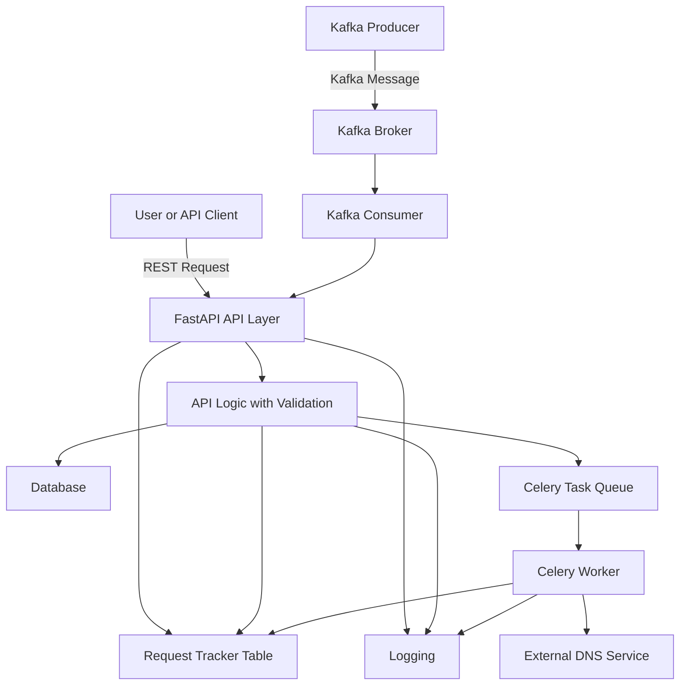

# Application Architecture and Structure

    - User/API Client sends a REST request to the FastAPI API layer.
    - External system sends a message to Kafka Broker.

2.  **Kafka Consumer** (`scripts/run_consumer.py`) consumes messages from Kafka and calls the FastAPI API (as if it were a client).
3.  **API Layer** (FastAPI) receives requests (from user or Kafka consumer), immediately creates a new entry in the **Request Tracker Table** and starts logging.
4.  **API Logic** performs validation and business operations, updating the **Request Tracker Table** and logs at every step, interacts with the main database, and enqueues async tasks to Celery.
5.  **Celery Task Queue** receives async jobs, processed by **Celery Worker**.
6.  **Celery Worker** performs the actual DNS provisioning (e.g., via external DNS service), and updates the **Request Tracker Table** and logs with results.
7.  **Observability:** Logging and request tracking start as soon as the request is received and are updated at every step for full traceability.

**Key Points:**
- Both Kafka and API are entry points for requests.
- Kafka consumer always calls the API for business logic, ensuring a single flow.
- Request tracking and logging start as soon as the API receives a request and are updated at every step (API, Celery, etc.).

## 2. Directory Structure and Purpose

```
.
├── app/                  # Main application source code
│   ├── api/              # API Logic (Business Logic for Endpoints)
│   │   ├── common/       # Common API utilities shared across versions
│   │   ├── v1/           # Version 1 API logic
│   │   │   └── api.py    # Logic for v1 endpoints
│   │   └── v2/           # Version 2 API logic
│   │       └── api.py    # Logic for v2 endpoints
│   ├── celery/           # Celery-related files
│   │   └── tasks.py      # Celery task definitions
│   ├── core/             # Core application components
│   │   ├── celery_app.py # Celery application instance
│   │   ├── config.py     # Application settings and configuration
│   │   ├── database.py   # Database connection and session management
│   │   ├── logging.py    # Logging configuration
│   │   └── secrets.py    # Centralized Secrets Management (CSM) integration
│   ├── kafka/            # Kafka-related components
│   │   └── consumer.py   # Kafka consumer logic
│   ├── models/           # SQLAlchemy database models
│   │   ├── migrations/   # Alembic migration scripts
│   │   └── models.py     # Database models
│   ├── routes/           # API Routing Definitions
│   │   ├── v1/           # Version 1 API routes
│   │   │   └── routes.py # Route definitions for v1
│   │   └── v2/           # Version 2 API routes
│   │       └── routes.py # Route definitions for v2
│   ├── schemas/          # Pydantic models for request/response validation
│   │   ├── request.py    # Request models
│   │   └── response.py   # Response models
│   └── utils/            # General-purpose utility functions/modules (e.g., helpers, common functions)
├── deployment/           # Deployment-related files (Docker, Kubernetes/OpenShift manifests)
│   ├── Dockerfile.app    # Dockerfile for the FastAPI application image
│   ├── Dockerfile.worker # Dockerfile for the Celery worker image
│   ├── docker-compose.yml # Docker Compose for local development setup
│   ├── entrypoint.sh     # Main application entrypoint script for Docker
│   └── celery_worker_entrypoint.sh # Celery worker entrypoint script for Docker
├── env/                  # Environment-specific configuration files (.env files)
│   ├── .env.dev          # Development environment variables
│   ├── .env.prod         # Production environment variables
│   └── .env.uta          # User Testing Acceptance environment variables
├── scripts/              # Standalone executable scripts (e.g., run_consumer.py)
├── tests/                # Unit and integration tests
├── alembic.ini           # Alembic configuration file (if initialized)
├── pyproject.toml        # Poetry project definition and dependencies
├── poetry.lock           # Poetry lock file (exact dependency versions)
├── POETRY_GUIDE.md       # Guide for Poetry setup and usage
└── README.md             # Project overview and main entry point
```

## 3. What to Write Where

*   **`app/api/vX/api.py`**:
    *   **Purpose:** Contains the actual business logic for your API endpoints. This is where you'll write the code that interacts with the database, calls external services, or dispatches tasks.
    *   **Content:** Functions that perform operations like creating, reading, updating, or deleting resources. These functions should be pure Python functions that take necessary arguments and return data. They should *not* contain FastAPI decorators (`@router.get`, `@router.post`, etc.).
    *   **Example:** A function `create_dns_record_logic(data: DnsRequestCreate, db: Session)`

*   **`app/routes/vX/routes.py`**:
    *   **Purpose:** Defines the API endpoints and maps them to the corresponding business logic functions. This is the "routing" layer.
    *   **Content:** FastAPI `APIRouter` instances, and functions decorated with `@router.get`, `@router.post`, etc. These functions should primarily call the logic functions from `app/api/vX/api.py` and handle request/response serialization.
    *   **Example:**
        ```python
        from fastapi import APIRouter, Depends
        from app.api.v1.api import create_dns_record_logic

        router = APIRouter()

        @router.post("/create")
        def create_dns_record(request: DnsRequestCreate, db: Session = Depends(get_db)):
            return create_dns_record_logic(request, db)
        ```

*   **`app/schemas/`**:
    *   **Purpose:** Defines the data structures for your application.
    *   **Content:**
        *   `request.py`: Pydantic models for incoming request bodies.
        *   `response.py`: Pydantic models for outgoing response bodies.

*   **`app/models/`**:
    *   **Purpose:** Houses SQLAlchemy database models and Alembic migration scripts.
    *   **Content:**
        *   `models.py`: SQLAlchemy ORM models that define your database tables.
        *   `migrations/`: Directory containing Alembic migration scripts.

*   **`app/core/`**:
    *   **Purpose:** Contains fundamental, cross-cutting concerns of your application.
    *   **Content:** Configuration loading, database connection setup, logging configuration, secrets management integration, Celery application instance.

*   **`app/celery/`**:
    *   **Purpose:** Houses Celery task definitions.
    *   **Content:**
        *   `tasks.py`: Definitions of your Celery tasks (functions decorated with `@celery_app.task`).

*   **`app/kafka/`**:
    *   **Purpose:** Contains Kafka-specific consumer and producer logic.
    *   **Content:** Functions or classes that interact with Kafka brokers to consume or produce messages.

*   **`app/utils/`**:
    *   **Purpose:** For general-purpose utility functions or modules that are reusable across different parts of the `app/` package and are not specific to API, database, or messaging.
    *   **Content:** Helper functions for data manipulation, common validators, custom exceptions, etc.

*   **`app/api/common/`**:
    *   **Purpose:** For utility functions or modules that are specific to the API layer but are shared across different API versions (e.g., `v1`, `v2`).
    *   **Content:** Common authentication helpers, response transformers, request pre-processors that apply to multiple API versions.

*   **`deployment/`**:
    *   **Purpose:** Contains all files related to deploying your application.
    *   **Content:** Dockerfiles, Docker Compose files, Kubernetes/OpenShift manifests (e.g., YAML files for Deployments, Services, Routes, ConfigMaps, Secrets), shell scripts for container entrypoints.

*   **`env/`**:
    *   **Purpose:** Stores environment-specific configuration variables.
    *   **Content:** `.env` files for development, production, testing, etc. (e.g., database URLs, API keys, external service endpoints). These files should NOT be committed to version control if they contain sensitive information.

*   **`scripts/`**:
    *   **Purpose:** For standalone executable Python scripts that perform specific tasks (e.g., data migration scripts, one-off administrative tasks, consumer runners).
    *   **Content:** `run_consumer.py` or similar.