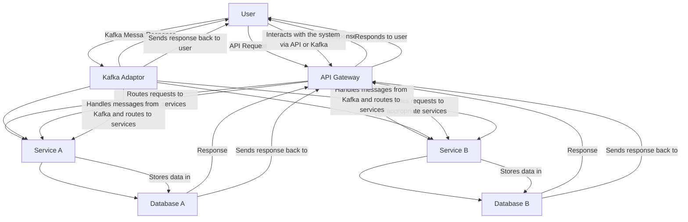

# Workflow Diagrams

This document contains the workflow diagrams for the project.

## Updated Workflow Diagram

```mermaid
flowchart TD
    A[User] -->|API Request| B[API Gateway]
    A -->|Kafka Message| C[Kafka Adaptor]
    B --> D[Service A]
    B --> E[Service B]
    C --> D
    C --> E
    D --> F[Database A]
    E --> G[Database B]
    F -->|Response| B
    G -->|Response| B
    B -->|Response| A
    C -->|Response| A

%% Expanded Details

A[User] -->|Interacts with the system via API or Kafka| B[API Gateway]
B[API Gateway] -->|Routes requests to appropriate services| D[Service A]
B[API Gateway] -->|Routes requests to appropriate services| E[Service B]
C[Kafka Adaptor] -->|Handles messages from Kafka and routes to services| D[Service A]
C[Kafka Adaptor] -->|Handles messages from Kafka and routes to services| E[Service B]
D[Service A] -->|Stores data in| F[Database A]
E[Service B] -->|Stores data in| G[Database B]
F[Database A] -->|Sends response back to| B[API Gateway]
G[Database B] -->|Sends response back to| B[API Gateway]
B[API Gateway] -->|Responds to user| A[User]
C[Kafka Adaptor] -->|Sends response back to user| A[User]
```