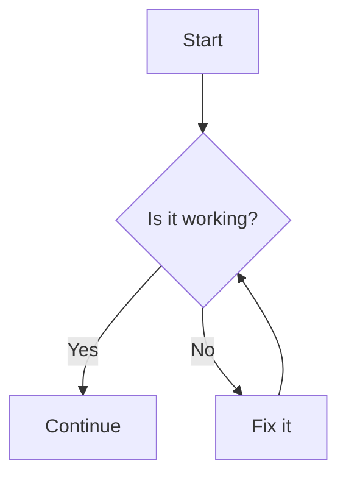
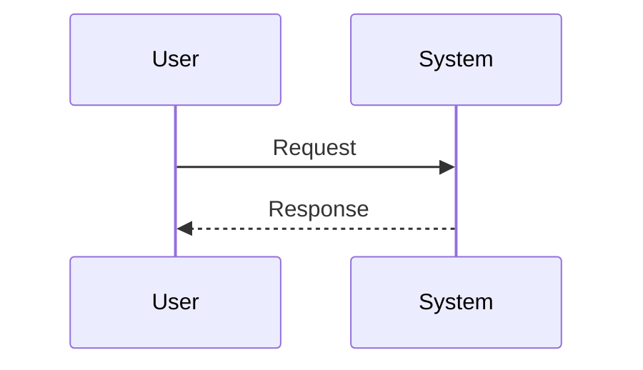

# Workflow Diagrams

This document contains the workflow diagrams for the project.

## Diagram 1

```mermaid
flowchart TD
    A[Start] --> B{Is it working?}
    B -->|Yes| C[Continue]
    B -->|No| D[Fix it]
    D --> B
```

## Diagram 2

```mermaid
sequenceDiagram
    participant User
    participant System
    User->>System: Request
    System-->>User: Response
```