# DNS Orchestrator Workflow Diagrams

This document provides comprehensive workflow diagrams for the DNS Request Orchestrator project using Mermaid syntax. These diagrams illustrate the various components, data flows, and processes within the system.

## Table of Contents

1. [System Architecture Overview](#system-architecture-overview)
2. [API Request Flow](#api-request-flow)
3. [Kafka Message Flow](#kafka-message-flow)
4. [Celery Task Processing](#celery-task-processing)
5. [Database Interactions](#database-interactions)
6. [CI/CD Workflow](#cicd-workflow)
7. [Container Orchestration](#container-orchestration)

---

## System Architecture Overview

This diagram shows the high-level architecture of the DNS orchestration service and how all components interact with each other.

```mermaid
graph TB
    subgraph "External Sources"
        CLIENT[HTTP Client]
        KAFKA_PRODUCER[Kafka Producer]
    end

    subgraph "Load Balancer/Gateway"
        LB[Load Balancer]
    end

    subgraph "Application Layer"
        API[FastAPI Application<br/>:8000]
        CONSUMER[Kafka Consumer]
        WORKER[Celery Worker]
    end

    subgraph "Message Queue"
        KAFKA[Apache Kafka<br/>Topic: dns_requests]
        REDIS[Redis<br/>Celery Broker]
    end

    subgraph "Database Layer"
        POSTGRES[(PostgreSQL<br/>Database)]
    end

    subgraph "External Services"
        ANSIBLE[Ansible<br/>DNS Provisioning<br/>(Simulated)]
    end

    %% External connections
    CLIENT --> LB
    KAFKA_PRODUCER --> KAFKA
    
    %% Load balancer to API
    LB --> API
    
    %% API interactions
    API --> POSTGRES
    API --> REDIS
    
    %% Kafka flow
    KAFKA --> CONSUMER
    CONSUMER --> API
    
    %% Celery flow
    REDIS --> WORKER
    WORKER --> POSTGRES
    WORKER --> ANSIBLE
    
    %% Styling
    classDef external fill:#e1f5fe
    classDef application fill:#f3e5f5
    classDef database fill:#e8f5e8
    classDef queue fill:#fff3e0
    
    class CLIENT,KAFKA_PRODUCER,ANSIBLE external
    class API,CONSUMER,WORKER application
    class POSTGRES database
    class KAFKA,REDIS queue
```

---

## API Request Flow

This diagram illustrates the complete flow when a DNS request is made through the HTTP API.


---

## Kafka Message Flow

This diagram shows how DNS requests are processed when they arrive via Kafka messages.


---

## Celery Task Processing

This flowchart details the asynchronous task processing workflow for DNS provisioning.


---

## Database Interactions

This diagram shows the database schema and relationships between tables.


### Database Operation Flow


---

## CI/CD Workflow

This diagram shows the GitHub Actions workflow for building and deploying the application.

```mermaid
flowchart TD
    PUSH[Push to develop branch] --> TRIGGER[Trigger GitHub Actions]
    PR[Pull Request to develop] --> TRIGGER
    
    TRIGGER --> CHECKOUT[Checkout Repository]
    CHECKOUT --> LOGIN[Login to Container Registry<br/>ghcr.io]
    
    LOGIN --> METADATA[Extract Metadata<br/>Tags & Labels]
    METADATA --> BUILD[Build Docker Image]
    
    BUILD --> TEST{Tests Pass?}
    TEST -->|No| FAIL[❌ Build Failed]
    TEST -->|Yes| PUSH_IMAGE[Push to ghcr.io]
    
    PUSH_IMAGE --> TAG[Tag as latest/version]
    TAG --> DEPLOY[🚀 Ready for Deployment]
    
    classDef trigger fill:#e3f2fd
    classDef process fill:#f3e5f5
    classDef success fill:#e8f5e8
    classDef failure fill:#ffebee
    
    class PUSH,PR trigger
    class CHECKOUT,LOGIN,METADATA,BUILD,PUSH_IMAGE,TAG process
    class DEPLOY success
    class FAIL failure
```



---

## Container Orchestration

This diagram shows how Docker Compose orchestrates all the services.


---

## Data Flow Summary

This high-level diagram summarizes the complete data flow through the system.


---

## Notes

- All diagrams use Mermaid syntax and can be rendered in GitHub, GitLab, or any Mermaid-compatible viewer
- The system supports multiple environment configurations (dev, uta, prod)
- Database migrations are handled automatically via Alembic during container startup
- Celery tasks are queued with a specific queue name: `dns_tasks`
- The Kafka consumer transforms messages to match the API schema before forwarding
- All services include structured JSON logging for observability
- The system is designed to be horizontally scalable with multiple worker instances
